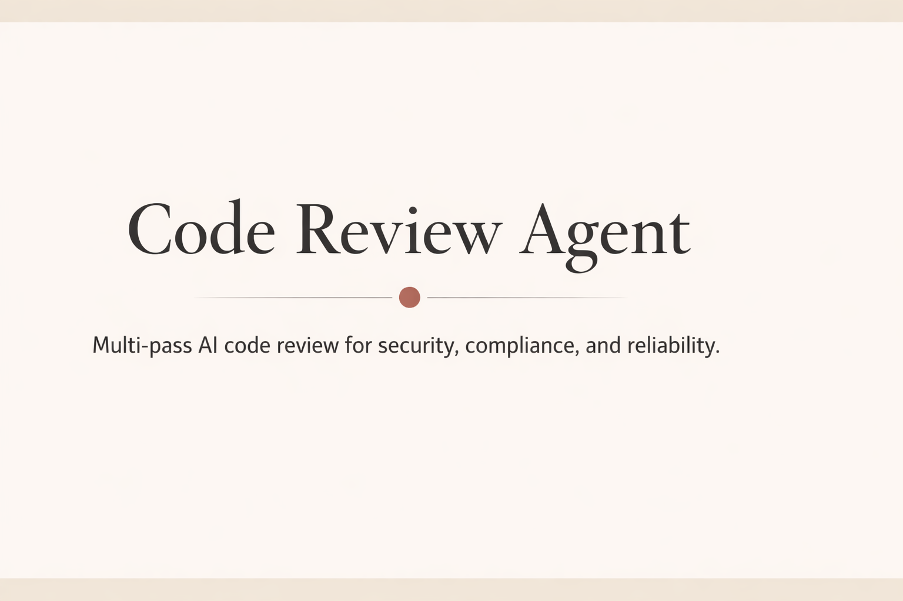

<div align="center">



# Code Review Agent

**Shift-Left Security: Catch Vulnerabilities Before Production**

*AI-powered code review with **SDL Multi-Agent Security Squad** (SAST+DAST+SCA) + STRIDE/DREAD threat modeling for production security.*

[](LICENSE)
[](https://www.python.org/)
[](https://github.com/adarian-dewberry/code-review-agent/actions)
[](https://codecov.io/gh/adarian-dewberry/code-review-agent)
[](https://adarian-dewberry.github.io/code-review-agent)
[](https://github.com/psf/black)
[](https://github.com/adarian-dewberry/code-review-agent/security/dependabot)
[](https://github.com/adarian-dewberry/code-review-agent)

</div>

---

> ⚠️ **Important**: Read the [DISCLAIMER.md](DISCLAIMER.md) before use. This tool does NOT replace professional security audits or legal compliance reviews.

## Vibe Securely (60-Second Flow)

**Paste AI code → Get fixes → Ship confidently**

1. Paste AI-generated code into the tool
2. Get **OWASP + CWE mapped** findings with risk levels
3. Apply fixes before the code reaches production

- [docs/vibe_checklist.txt](docs/vibe_checklist.txt)

**Secure prompt templates:**
- [docs/prompt_library.txt](docs/prompt_library.txt)

---

## Live Demo (Hugging Face Spaces)
Run a local demo (no deployment required):

```bash
pip install -e ".[dev]"
streamlit run demo/streamlit_app.py
```

**Demo mode** lets you explore output without sending code to an LLM.

We tested 10 intentional vulnerabilities (OWASP Top 10) against industry-standard Semgrep:

| Metric | Semgrep | Code Review Agent |
|--------|---------|-------------------|
| **Detection Rate** | 40% (4/10) | **100% (10/10)** |
| **False Positives** | 0 | 0 |
| **Scan Time** | ~2s | ~15s |
| **Custom Rules** | ❌ Requires YAML | ✅ Natural language |

**Code Review Agent detected:**
- ✅ All SQL injection patterns (f-strings, concatenation)
- ✅ Hardcoded credentials (Semgrep missed)
- ✅ Path traversal vulnerabilities (Semgrep missed)
- ✅ Weak crypto for security contexts (Semgrep missed)

**Full benchmark results:** [docs/BENCHMARKS.md](docs/BENCHMARKS.md)

---

## 🛡️ SDL Multi-Agent Security Squad

Enable STRIDE/DREAD threat modeling, SDL phase gates (A1–A5), and Security Champion checklists:

- **SAST Agent:** Semgrep/Bandit + STRIDE mapping
- **DAST Agent:** Fuzz testing simulation + OWASP ZAP patterns
- **SCA Agent:** Dependency CVE analysis
- **SDL Champion:** DREAD scoring + phase gate enforcement

**Docs:** [docs/SDL_MULTI_AGENT.md](docs/SDL_MULTI_AGENT.md)

**CLI:**

```bash
code-review review --sdl-mode path/to/code.py
```

**CLI demo script:**

```bash
python security_squad.py --file app.py --sdl-full
```

---

Modern development teams face a critical challenge:
- **AI-generated code is fast but unsafe** - GitHub Copilot, ChatGPT, and Claude excel at generating code quickly, but lack security context
**Code Review Agent** solves this by **shifting security left** - catching issues at the point of code creation, before they reach production.

## Why This Tool Matters: The ROI Conversation
- ⚖️ **Regulatory compliance evidence** - Demonstrates due diligence for GDPR, CCPA, SOC 2 audits
- ✅ **Categorizes risks by OWASP Top 10 & CWE** - speaks the language of auditors
- ✅ **Flags regulatory violations early** - GDPR, CCPA, EU AI Act, HIPAA, PCI-DSS


- EU AI Act: High-risk AI system documentation
- Off-by-one errors, infinite loops
- Race conditions, unhandled edge cases

**Performance Review**: Identifies scalability risks
- N+1 query problems, database inefficiencies
- Memory leaks, unbounded loops
- Missing caching strategies

---

## Quick Start

### Installation
```bash
# Clone repo
git clone https://github.com/adarian-dewberry/code-review-agent.git
cd code-review-agent
python3 -m venv .venv
source .venv/bin/activate  # macOS/Linux
# .\.venv\Scripts\Activate.ps1  # Windows PowerShell

# Install with dev dependencies
pip install -e ".[dev]"

# Set up pre-commit hooks
pre-commit install

# Set API key
export ANTHROPIC_API_KEY=your_key_here
```

---

---

## 🚀 Hugging Face Spaces Deployment
### Option 1: Deploy to Hugging Face Spaces (Free)

1. **Fork this repository** to your GitHub account
2. Go to [https://huggingface.co/spaces](https://huggingface.co/spaces)
3. Click "Create new Space"
4. Choose SDK: **Streamlit**
5. Connect GitHub repo: `your-username/code-review-agent`
6. Set app file: `demo/streamlit_app.py`
7. Add secret: `ANTHROPIC_API_KEY` in **Settings → Secrets**
8. Click "Create Space"

Your app will be live at: `https://huggingface.co/spaces/your-username/space-name`

**Public demo URL (placeholder):** `https://huggingface.co/spaces/your-username/space-name`

### Prep Checklist (GitHub Push + Hugging Face Spaces)

- Add `CODECOV_TOKEN` in GitHub Secrets for dynamic coverage badges
- Enable GitHub Pages (Settings → Pages → Deploy from branch)
- Add `ANTHROPIC_API_KEY` in Hugging Face Secrets for live demo

### Option 2: Local Deployment

```bash
# Install dependencies
pip install -e ".[dev]"

# Run locally
streamlit run demo/streamlit_app.py
```

## Demo: Tool in Action

> **Note**: Visual demo (GIF/screenshot) coming soon - showing the tool detecting SQL injection, missing audit trails, and N+1 queries in VS Code.

**What it looks like:**
1. Developer writes code with security issues
   - Risk level (CRITICAL)
**Example output format:**
```
## CRITICAL
  Risk Level: CRITICAL
  Fix: Use parameterized queries...
```

---

### Basic Usage
code-review review path/to/code.py

# Review git changes
git diff main | code-review review --stdin

# CI/CD mode (fails if critical issues found)
code-review review --ci-mode path/to/code.py

# SDL Multi-Agent Security Squad mode
code-review review --sdl-mode path/to/code.py
```
```markdown
# Code Review Report

**File:** `vendor_risk_scorer.py`

## Summary

- **Recommendation:** `DO_NOT_MERGE`
- **Critical Issues:** 2
- **Medium Issues:** 3

### Top Issues
- [SECURITY] SQL injection vulnerability (line 45)
- [COMPLIANCE] PII accessed without audit trail (line 78)
- [SECURITY] Missing rate limiting (line 102)

## Security Review

**SQL injection vulnerability (line 45)**
- Risk: Attacker can extract entire database by manipulating vendor_name parameter
  result = db.execute(query, (vendor_name,))
- Risk: API endpoint can be abused to exhaust Claude token budget
```
```python
  audit_log.record(
      data_accessed="vendor_contact_email",
      purpose="risk_scoring"
  )
```
| **Pre-Commit (This Tool)** | $1,000 | 87% | **$43,500** |
| **Code Review (Manual)** | $5,000 | 40% | $100,000 |

**Why the multiplier exists:**

**With Code Review Agent:**
- 📊 **Instant audit documentation** - Every commit has security attestation
- 🛡️ **Reduced cyber insurance premiums** - Demonstrable proactive security posture
- 💼 **Avoided regulatory fines** - GDPR violations start at €20M

---

## Features

- **Multi-pass Review**: Security, compliance, logic, and performance checks
- **OWASP & CWE Mapping**: Professional risk classification for audit trails
- **CLI Interface**: Easy-to-use command-line tool (2-second reviews)
- **CI/CD Integration**: Fail builds with critical issues automatically
- **GitHub Actions CI**: Lint, type-check, and tests on every PR
- **Structured Output**: Markdown reports and JSON data (with risk levels)
- **File Exclusion**: Skip node_modules, .env, and other safe patterns automatically
- **Data Privacy**: Explicit warning before sending code to Claude API
- **Configurable**: Custom categories, risk thresholds, and exclusions

### Custom Rules (Experimental)

Start with a template for organizational policies:
- [config/custom_rules.yaml](config/custom_rules.yaml)

---

## Security Methodology

This tool follows industry-standard security classification frameworks:

### OWASP Top 10 (2021) Coverage
The tool detects all categories from the OWASP Top 10:
- **A01:2021** – Broken Access Control
- **A02:2021** – Cryptographic Failures
- **A03:2021** – Injection
- **A04:2021** – Insecure Design
- **A05:2021** – Security Misconfiguration
- **A06:2021** – Vulnerable and Outdated Components
- **A07:2021** – Authentication & Session Management Flaws
- **A08:2021** – Software & Data Integrity Failures
- **A09:2021** – Logging & Monitoring Failures
- **A10:2021** – Server-Side Request Forgery (SSRF)

### CWE-Based Classification
Each finding is tagged with its CWE (Common Weakness Enumeration):
- Example: **CWE-89** (SQL Injection), **CWE-502** (Deserialization of Untrusted Data)
- Enables correlation with known exploits and vulnerability databases

### Risk Levels
All findings are categorized by business impact:
- **CRITICAL**: Exploitable immediately, regulatory violation
- **HIGH**: Significant security impact, compliance gap
- **MEDIUM**: Defense-in-depth concern, best practices
- **LOW**: Theoretical risk, hardening recommendation

### Quantum-Safe Crypto (2026 Edge)
Plan migration toward post-quantum cryptography (e.g., Kyber/Dilithium) for long-lived secrets and high-sensitivity data.

### Compliance Frameworks
- **GDPR**: Article 32 (Security measures), Article 30 (Records of processing)
- **CCPA**: Consumer rights (access, deletion), privacy notices
- **EU AI Act**: High-risk AI documentation, transparency
- **HIPAA**: PHI protection, audit trails
- **PCI-DSS**: Secure coding, testing requirements

---

## Features

- **File Exclusion**: Skip node_modules, .env, and other safe patterns
- **Data Privacy**: Explicit warning before sending code to Claude API
- **Configurable**: Custom categories, risk thresholds, and exclusions

## Configuration

Create a `.env` file based on `.env.example`:

```bash
ANTHROPIC_API_KEY=your_api_key_here
```

Override settings in `config.yaml`:

```yaml
model:
  name: "claude-sonnet-4-20250514"
  max_tokens: 4000
  temperature: 0.0

review:
  enabled_categories:
    - security
    - logic
    - performance
    - compliance
  fail_on_critical: true
  fail_on_high: false
  
  # Exclude patterns (glob-style)
  exclude_patterns:
    - "*.min.js"
    - "node_modules/**"
    - ".env"
  
  # Data privacy: warn before sending code
  warn_before_sending: true
```

## Project Structure

```
code-review-agent/
├── code_review_agent/
│   ├── agent.py              # Core review orchestration
│   ├── cli.py                # CLI interface
│   ├── config.py             # Configuration management
│   ├── models.py             # Data models (Pydantic)
│   ├── parsers.py            # Claude response parsing
│   ├── prompts/              # Review prompts by category
│   ├── utils/                # Helper utilities
│   └── tests/                # Test suite
├── config.yaml               # Default configuration
├── setup.py                  # Package setup
├── requirements.txt          # Production dependencies
├── requirements-dev.txt      # Development dependencies
└── README.md                 # Documentation
```

## Development

```bash
# Install development dependencies
pip install -e ".[dev]"

# Run tests
pytest

# Run with coverage
pytest --cov=code_review_agent

# Format code
black code_review_agent tests

# Check linting
flake8 code_review_agent tests

# Type checking
mypy code_review_agent
```

## License & Disclaimer

**License**: [MIT License](LICENSE) - Free to use, modify, and distribute with attribution.

**Disclaimer**: This tool is provided "AS IS" without warranties. It does NOT replace professional security audits, legal compliance reviews, or manual code review. 

⚠️ **Read the full [DISCLAIMER.md](DISCLAIMER.md) before use.**

**Key Points:**
- AI models may produce false positives/negatives
- Your code is sent to Anthropic's Claude API
- No guarantee of regulatory compliance (GDPR, HIPAA, etc.)
- Not a substitute for professional security assessments
- Users are responsible for validating all findings

## Contributing

See CONTRIBUTING.md for guidelines
